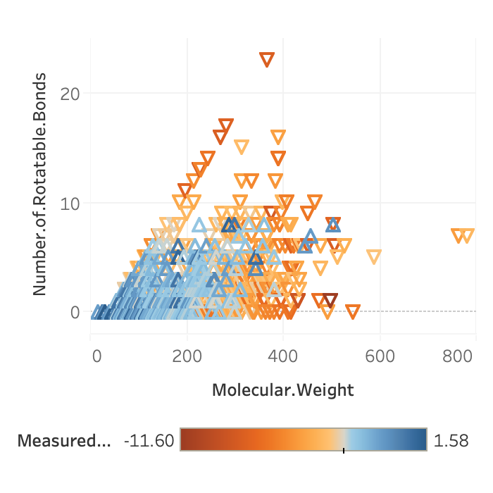
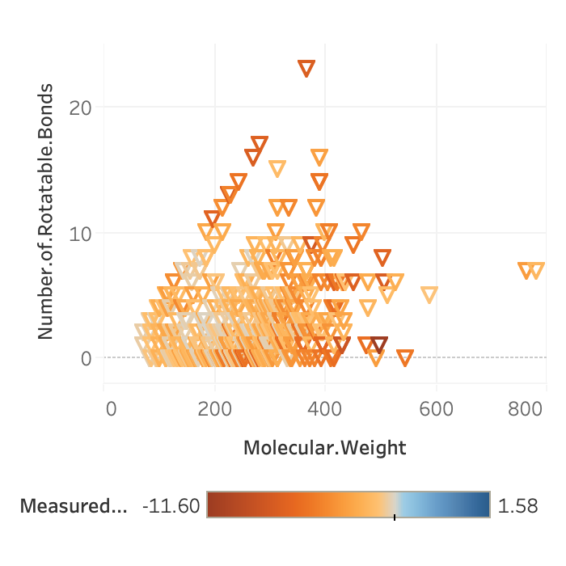
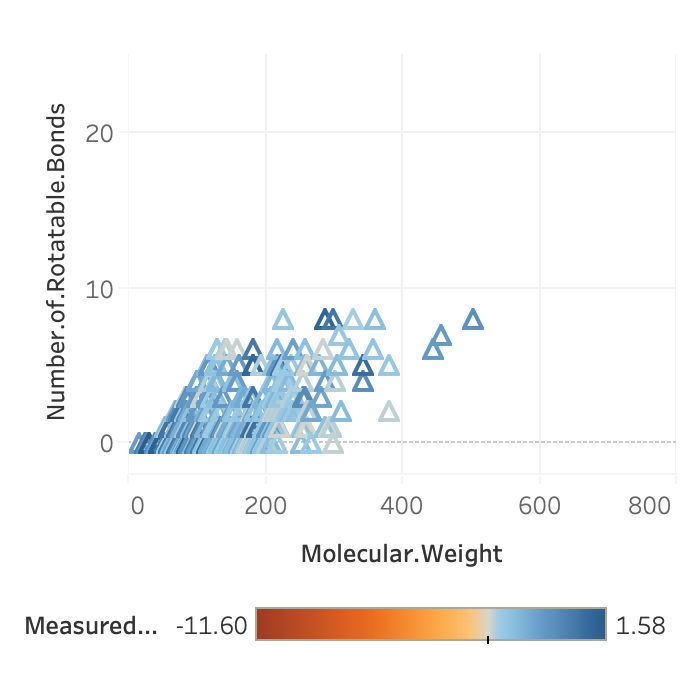
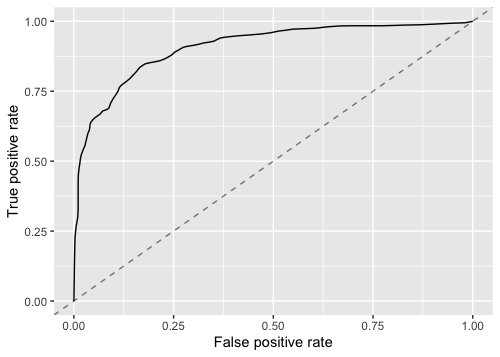
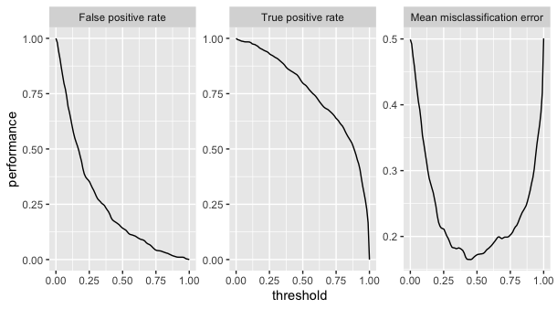

# Delaney Binary Classification

## Introduction

In 2004, John Delaney published a paper which studied a method to predict the aqueous solubility of various compounds [(Delaney, 2004)](https://pubs.acs.org/doi/10.1021/ci034243x) . This paper is widely cited in the machine learning and deep learning literature for chemistry applications. It is like a Titanic or MNIST dataset for the chemistry ML community. The data are labeled with the known solubility in log solubility in mol/L.

Starting the with the ESOL method described by Delaney in 2004, there have been multiple discussions of predicting solubility from these data. Here are two of them:

1.	[http://practicalcheminformatics.blogspot.com/2018/09/predicting-aqueous-solubility-its.html](http://practicalcheminformatics.blogspot.com/2018/09/predicting-aqueous-solubility-its.html)
1.	[https://github.com/deepchem/deepchem/blob/master/examples/tutorials/03_Modeling_Solubility.ipynb](https://github.com/deepchem/deepchem/blob/master/examples/tutorials/03_Modeling_Solubility.ipynb)

For this study, my interests are exploratory data analysis and comparing the performance of various models with these data. To simplify the first iteration of this process, I changed this from a regression of a continuous value of solubility into a binary classification. The two classes are:

1. Those compounds with solubility higher than the median solubility across the whole dataset
1. Those compounds with a solubility lower than the median solubility across the whole dataset.

## Methods

### Tools

I used the R language with the tidyverse, mlr, and keras libraries for analysis and Tableau software for exploratory data visualization.

### Data description

[FILL THIS IN]

### Data Preparation

For this test, I am not using the names of the compounds or the SMILES strings. The numeric features available are:

1. Minimum degree
1. Molecular weight
1. Number of H Bond Donors
1. Number of Rings
1. Number of Rotatable Bonds
1. Polar Surface Area
1. Measured solubility
1. ESOL predicted solubility

I preprocessed the data to and saved it as a .csv file so that all scripts and visualization analyses could start from a common point. My method for preprocessing was to calculate the value of the median value and then map a new variable onto each observation with 1 for an observation with a solubility above the median and 0 for an observation below the median. At the same time, the ESOL predicted solubility is dropped since I only used measured solubility in this dataset. Also, since I did not use the SMILES string, I dropped that variable as well.

### Feature Extraction

Of the variables available in the input data I had available, the 2004 study mentioned that molecular weight and number of rotatable bonds as being among the most significant predictors in making the ESOL model, so I started with those two variables. I was interested in the contribution of polar surface area as well. This gave me three sets of predictor variables I used to work with the models:

1. Molecular Weight and Number of Rotatable Bonds
1. Molecular Weight, Number of Rotatable Bond, and Polar Surface Area.

### Algorithms

#### Logistic Regression

To test the accuracy of logistic regression model, I used repeated k-fold cross validation, with 10 folds and 50 repetitions for a total of 500 iterations.

## Results

### Exploratory analysis

Noting the importance of molecular weight and number of rotatable bonds in the 2004 study, I made the following three plots to explore the relation. For each of the plots, the shape of the triangle, up or down, represents above or below median solubility, respectively. The color span from orange to blue represents the continuous value of solubility.

First, I plotted all observations, whether they were above or below solubility:

Then I plotted the observations that were below the median solubility:

Then I plotted the observations that were above the median solubility:

The observations that were above the median solubility are tightly clustered at lower molecular weights and lower numbers of rotatable bonds. The observations that were below the median are all over the plot. Given the presence of a discernable cluster of above median observations, I decided to make these two variables the predictors for my first runs of the algorithms. 

### Logistic Regression

As noted in the methods section, I used repeated k-fold cross validation of 50 repetitions of 10 folds each. The performance metrics I used were accuracy, false negative rate (fnr), and false positive rate (fpr). I ran two runs, one each with the two different sets of predictor variables. The following table shows the results of the two runs:

| Predictors                                                      | Mean Accuracy | Mean FPR | Mean FNR
|-----------------------------------------------------------------|---------------|----------|---------
| Molecular Weight, Number of Rotatable Bonds                     | 75.9%         | 20.5%    | 27.6%
| Molecular Weight, Number of Rotatable Bonds, Polar Surface Area | 82.8%         | 14.2%    | 20.2%

Using the second row of predictors above, I created an ROC curve for the first logistic model generated by the repeated k-fold cross-validation:

The three curves below are the true positive rate, false positive rate, and mean misclassification error as a function of threshold:

